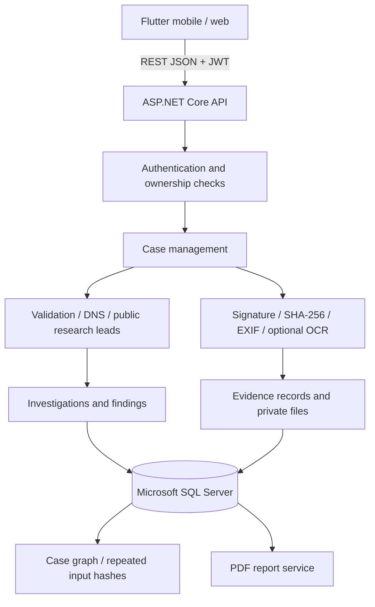

# System architecture

Core has no database or ASP.NET dependencies. Infrastructure implements Core interfaces, including case/auth services in the corresponding repository/security files. API controllers expose the routes from the specification plus read/download/verification endpoints needed by the UI.

There is no mobile-to-database connection. Database credentials and JWT signing material stay on the server. Web preview serves only the compiled Flutter output; evidence is never statically served.
